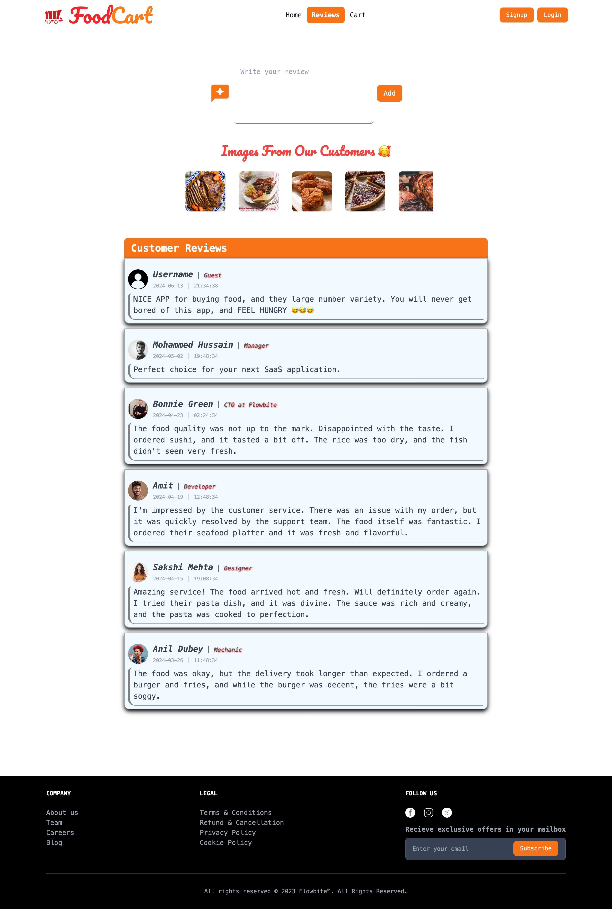
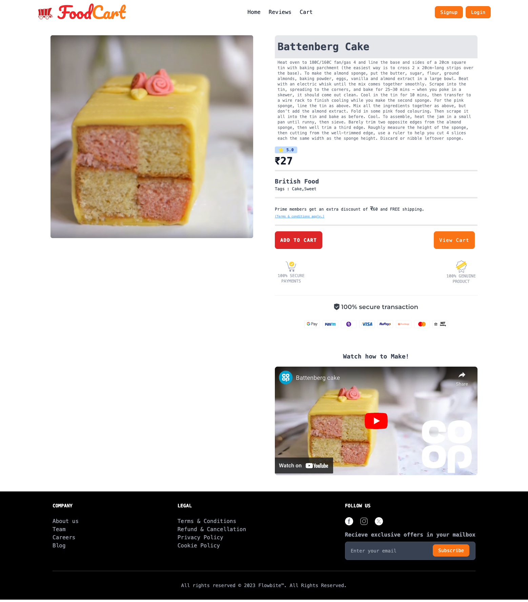

# FoodCart APP


## Description

FoodCart is a responsive food delivery application built using ReactJS. It leverages the power of modern React features such as components, hooks (`useState`, `useEffect`, and `useRef`) to create a seamless user experience for ordering food online.

## Screenshots

Here are some screenshots of the FoodCart app:
**HOME PAGE**


**REVIEWS PAGE**


**CART PAGE**


**PRODUCT DETAILED PAGE**


**EMPTY CART**


## Features

- **Food Item Display**: Browse through various food items with detailed descriptions and prices.
- **Food Item Description**: View detailed information about each food item.
- **Videos**: Watch videos if you want to make the food at home.
- **Recipe Requests**: Contact us at [hmohammed448@gmail.com](mailto:hmohammed448@gmail.com) for recipe requests. We will apply them in the future.
- **Add to Cart**: Add food items to your cart with a single click.
- **Update Cart**: Update the quantity of items in your cart.
- **Remove Items**: Remove items from your cart.
- **View Cart and Checkout**: View the items in your cart and proceed to checkout.
- **Responsive Design**: Optimized for all devices.
- **Cart Management**: Persistent cart management using LocalStorage.
- **Order Placement**: Place orders easily through the app.

## Technologies Used

- **ReactJS**: Core library for building the user interface.
- **Tailwind CSS**: Utility-first CSS framework for styling.
- **Fetch API**: For making HTTP requests to fetch data.

## Installation

To get started with FoodCart, follow these steps:

1. **Clone the repository:**
   ```bash
   git clone https://github.com/your-username/foodcart.git
   ```
2. **Navigate to the project directory:**
   ```bash
   cd foodcart
   ```
3. **Install dependencies:**
   ```bash
   npm install
   ```
4. **Start the development server:**
   ```bash
   npm start
   ```

## Usage

After starting the development server, open your browser and navigate to - [Live server](`http://localhost:5173`) to start using FoodCart. Browse through the available food items, add them to your cart, and proceed to checkout.

Alternatively, you can visit the deployed application at:

- [FoodCart APP Live Website](https://koof-git.vercel.app/)

## Components

- **HOME**: The main landing page of the application.
- **Navbar**: Navigation bar with links to different sections of the app.
- **Footer**: Provides additional information and links.
- **Cart**: Manages the items added to the cart, including updating quantities and removing items.
- **Reviews**: Displays user reviews.
- **MenuList**: Shows the list of available food items.
- **FoodCard**: Displays individual food items with details such as name, price, and image. Allows users to add items to the cart.
- **ItemDetailedCard**: Detailed view of a selected food item.
- **Button**: Custom button component used across the app.
- **OrderSearch**: Search functionality for fast orders.
- **ExploreMenu**: Explore different menu categories and items.

## Optimization Techniques

- **State Management**: Efficient use of useState for managing component states.
- **Functions**: Modular functions to handle various operations within the app.
- **Timeout Handling**: Use of setTimeout for handling delayed actions and enhancing user experience.

## Development Timeline

This project took 5 days to complete.

## Contributing

We welcome contributions from the community! If you would like to contribute to FoodCart, please follow these guidelines:

1. Fork the repository.
2. Create a new branch for your feature or bugfix.
3. Commit your changes and push your branch to GitHub.
4. Open a pull request and describe your changes.

## Contact

If you need anything or have any questions, feel free to contact us at: [hmohammed448@gmail.com]
